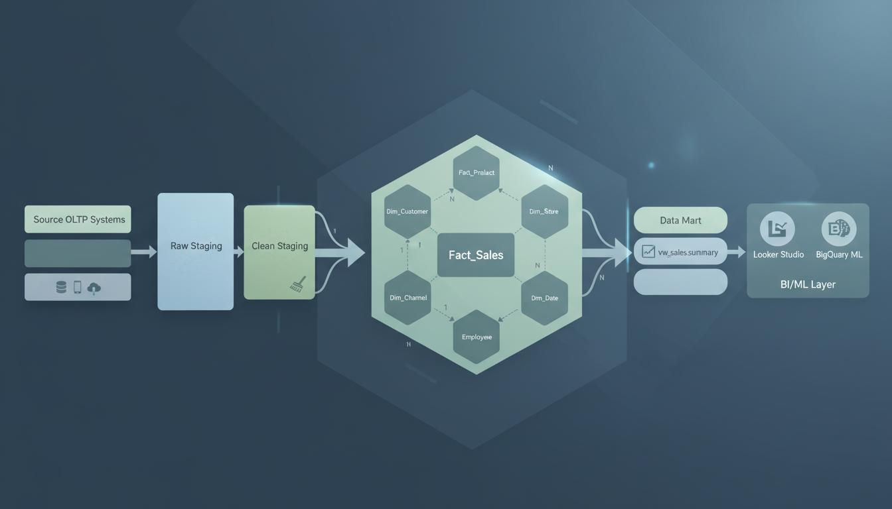
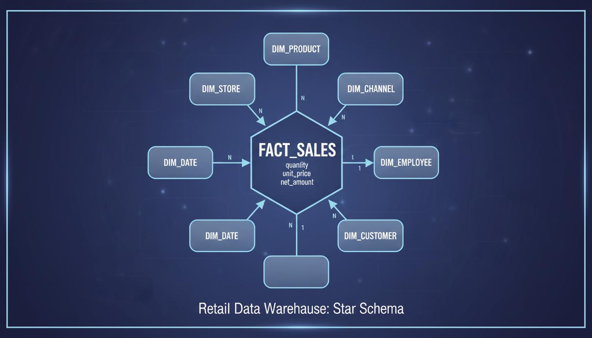
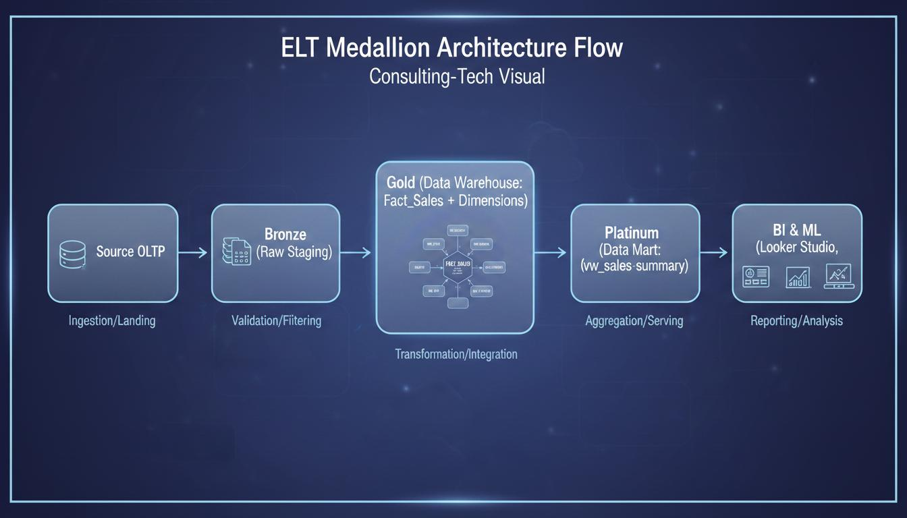
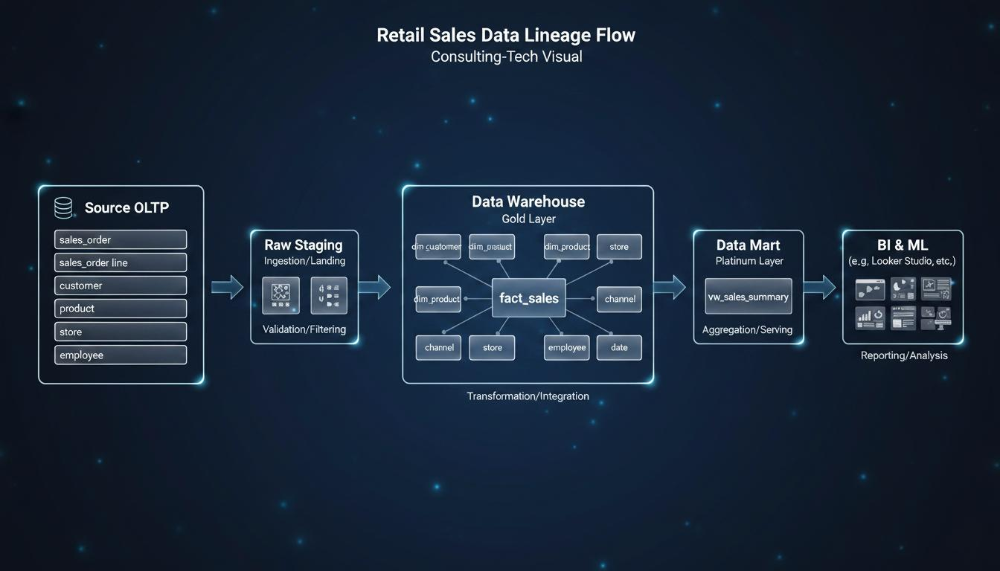
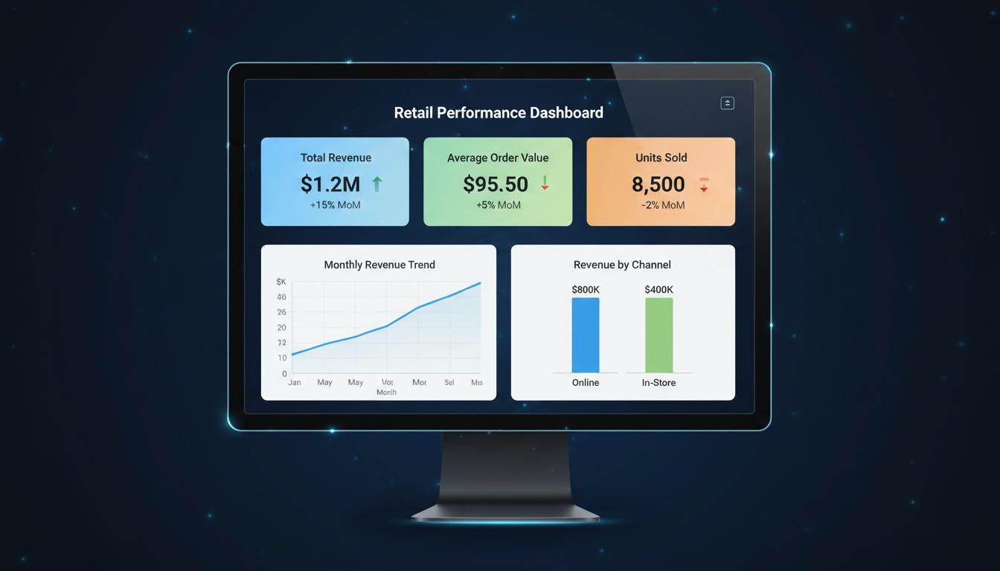
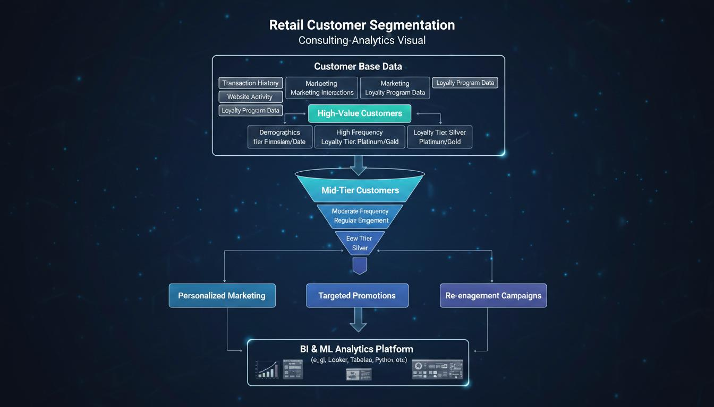
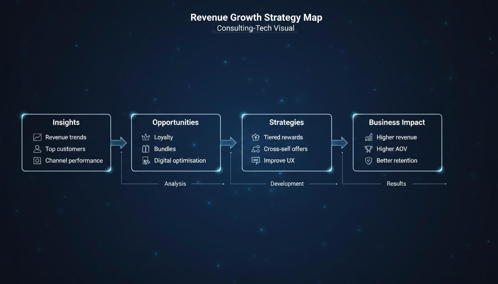
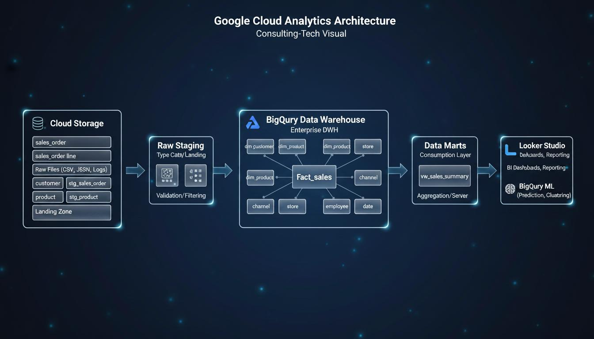

# 📊 Driving Revenue Growth Using a Data Warehouse

**A BigQuery analytics consulting study, from star schema to revenue strategy — Graded 88/100**


---

## 🎯 The Brief

I took the role of a Senior Data Consultant and answered one question for a retail client: how can a BigQuery data warehouse directly drive revenue?

The work runs end to end. I read the client's layered warehouse, wrote SQL against the curated data mart, pulled six analytical insights, and turned each one into a revenue strategy with a projected impact and an effort estimate. The thread holding it together is the BI value chain: data becomes information, information becomes insight, insight becomes a decision.

> **On the data:** the warehouse schema and the SQL are real and production-shaped. The result figures are simulated, built to match the lab environment and typical retail patterns. Metrics that would normally come from marketing or web-analytics systems (acquisition cost, ROAS, return rate) are illustrative, included to show what the warehouse would surface once those integrations exist.

---

## 🏗️ Architecture

The warehouse follows a four-layer medallion design on BigQuery, where data gains quality and business meaning as it moves through each layer:

- **`retail_stg_raw`** (Bronze) — raw CSV extracts landed from the OLTP system
- **`retail_stg`** (Silver) — validated, typed, quality-checked tables
- **`retail_dw`** (Gold) — the star schema, fact plus dimensions
- **`retail_dm`** (Platinum) — the curated analytical view `vw_sales_summary`, a single source of truth for KPI definitions



### Star schema

A classic retail star, built for OLAP. The grain is one row per sales transaction, with descriptive context pushed out to seven dimensions:

`fact_sales` → `dim_customer`, `dim_product`, `dim_category`, `dim_store`, `dim_channel`, `dim_employee`, `dim_date`



Keeping this separate from the transactional OLTP database is the whole point. OLTP is tuned for fast writes and consistency (orders, payments). OLAP is tuned for reading history back in aggregate, which is what revenue analysis needs.



---

## 🧮 The SQL

Six insights, each from a query against `retail_dm.vw_sales_summary`. The full script is in [`sql/analytical_insights.sql`](sql/analytical_insights.sql).

| # | Insight | What it answers | SQL technique |
|---|---------|-----------------|---------------|
| 1 | Revenue Trends Over Time | When does revenue peak? | `GROUP BY` time aggregation |
| 2 | Top Product Categories | Where is revenue concentrated? | Ranked aggregation |
| 3 | Customer Spend Segmentation | Who are the top spenders? | `RANK()` window function |
| 4 | Channel Performance | Online or in-store? | Channel aggregation |
| 5 | AOV & Basket Size | How much per order? | `AVG()` metrics |
| 6 | RFM Segmentation | Who is loyal, who is churning? | CTEs + `NTILE(5)` + `CASE` |

The RFM query is the centrepiece. It scores every customer on Recency, Frequency and Monetary value using `NTILE(5)`, then labels them with a `CASE` expression into Champions, Loyal, Promising, At Risk and Lost. That single query is what turns a spend report into a retention plan.



---

## 🔑 What the Analysis Found

*Figures below are illustrative, generated to match the lab schema and typical retail behaviour.*

**Revenue is concentrated in a few customers.** The top 1% of customers account for roughly 28% of revenue, and the top 25% deliver about 85%. That concentration is the case for a loyalty programme.

**Two categories carry the business.** Electronics and Home & Living together drive around 57% of revenue. Electronics has the highest order value but the thinnest margin. Beauty sells little but carries the fattest margin, which reads as a premium-positioning opening.

**Online is pulling ahead.** The online channel holds 54% of revenue and grows about 2.6 times faster than in-store, with a higher average order value. Mobile is 68% of online revenue, so mobile-first is not optional.

**Baskets are shallow.** Average order value sits near €78, with 40% of orders containing a single item. Saturday orders run about 10% higher than the weekday average.

**RFM splits the base cleanly.** Champions are 18% of customers, At Risk 12%, Lost 8%. Each segment maps to a different action: VIP treatment, re-engagement, nurture.



---

## 💡 From Insight to Revenue

Each insight feeds a strategy with a projected uplift and a feasibility rating.

| Opportunity | Strategy | Projected uplift | Effort |
|-------------|----------|------------------|--------|
| Loyalty & retention | Tiered programme driven by RFM segments | +5–12% retention | Medium |
| Cross-sell & bundling | BigQuery ML association models on co-purchases | +10–15% AOV | Medium-High |
| Digital conversion | Checkout audit, A/B testing, recommendations | +8–20% conversion | Low-Medium |
| Seasonal promotions | Demand-driven discount allocation | +12–18% Q4 | High |
| Store performance | Looker KPIs by store and employee | +5–10% per store | Low |





---

## 🔭 Future Enhancements

Where this goes next, from reporting toward prediction:

- **BigQuery ML in the warehouse**: churn prediction with logistic regression, demand forecasting with `ARIMA_PLUS`, recommendations with matrix factorisation. No data movement, models live next to the data.
- **Streaming**: Pub/Sub and Dataflow for near-real-time KPIs, dynamic pricing and live inventory.
- **Semantic layer**: business-friendly entities with standard definitions, so dashboards and ad-hoc queries stop disagreeing on what "revenue" means.
- **Automated data quality**: tools like Great Expectations and Dataplex to catch schema drift and anomalies before they reach a decision.



---

## 🗂️ Repository Structure

```
Driving-Revenue-Growth-Using-a-Data-Warehouse/
├── README.md
├── sql/
│   └── analytical_insights.sql
├── report/
│   └── Driving_Revenue_Growth_Data_Warehouse.pdf
└── images/
    └── 01–08 architecture, schema and strategy diagrams
```

---

## 🎓 Academic Context

Submitted for the **Business Intelligence & Data Warehousing** module of the Data Analytics programme at **City College Dublin** (2026). Graded **88/100**.

Professor's feedback:

> *"This is a top-tier submission, combining academic rigor, technical depth, and real architectural thinking. One of the strongest submissions overall, near benchmark quality."*
> — Prof. Mark McEvoy

---

## 📚 Selected References

Kimball, R. & Ross, M. (2013). *The Data Warehouse Toolkit: The Definitive Guide to Dimensional Modeling* (3rd ed.). Wiley.

Inmon, W.H. (2005). *Building the Data Warehouse* (4th ed.). Wiley.

Davenport, T.H. & Harris, J.G. (2007). *Competing on Analytics: The New Science of Winning.* Harvard Business School Press.

Armbrust, M., Ghodsi, A., Xin, R. & Zaharia, M. (2020). *Lakehouse: A new generation of open platforms that unify data warehousing and advanced analytics.* CIDR 2020.

Chaudhuri, S. & Dayal, U. (1997). *An overview of data warehousing and OLAP technology.* ACM SIGMOD Record, 26(1), 65–74.

---

## 📫 Connect

[](https://www.linkedin.com/in/ofonsecamarcelo)
[](mailto:marcelo.dafonsecaoliveira@gmail.com)
[](https://github.com/mfonsecaoliveira)
